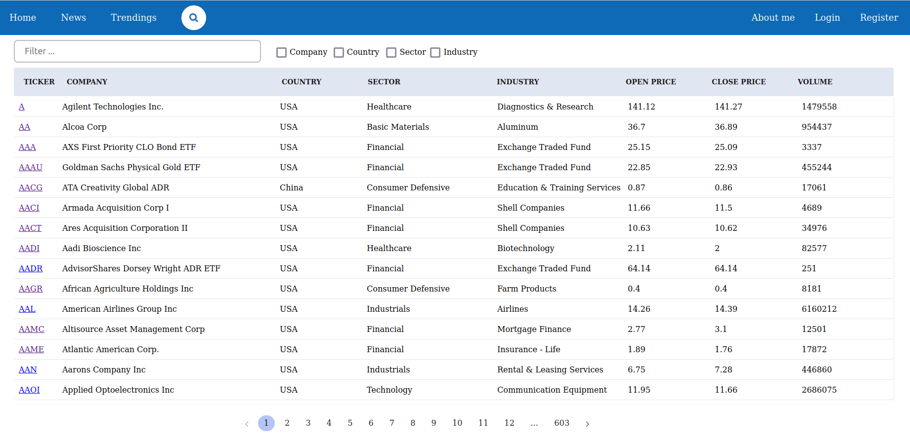
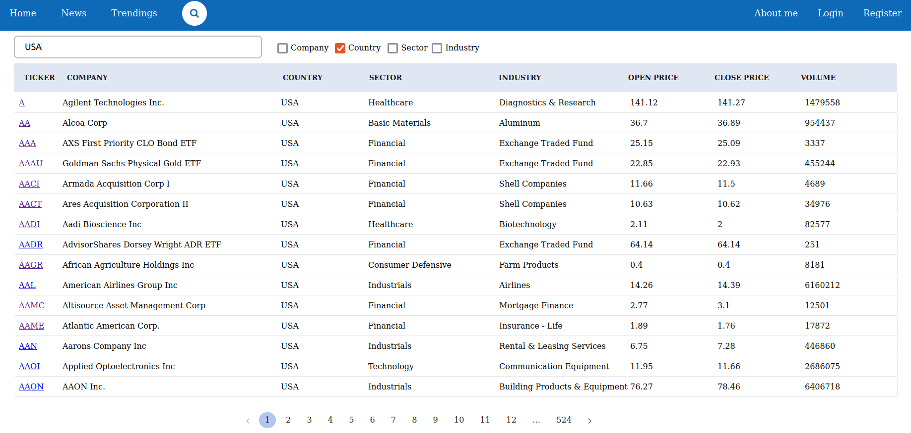
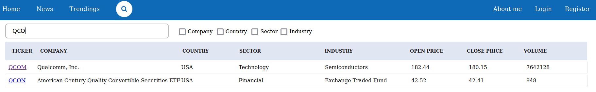
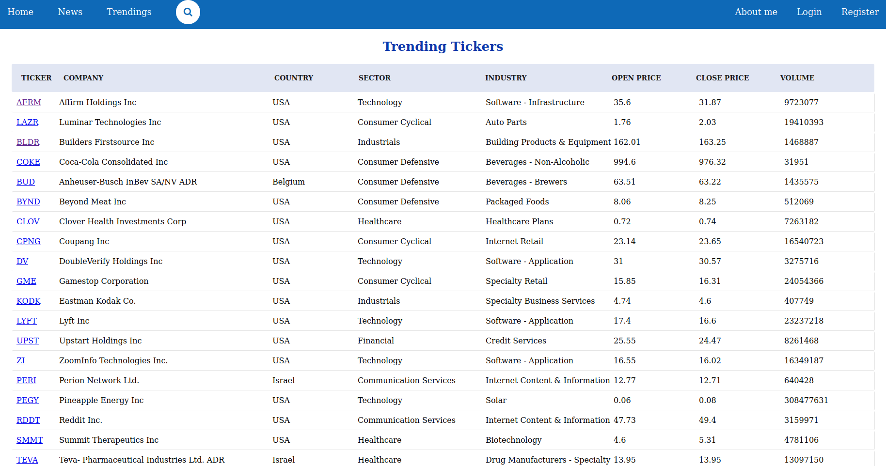
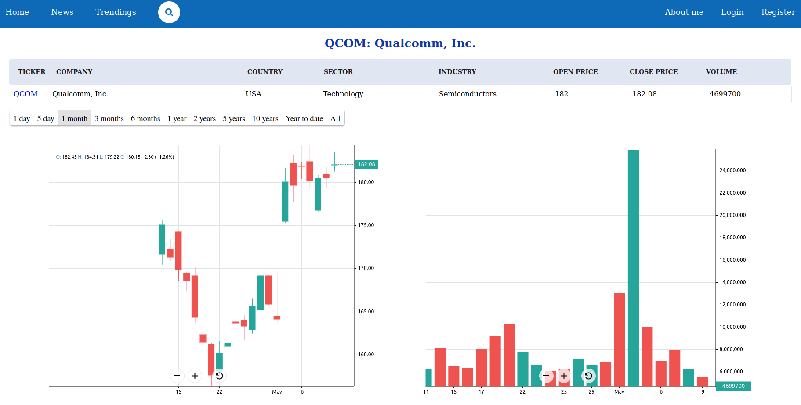
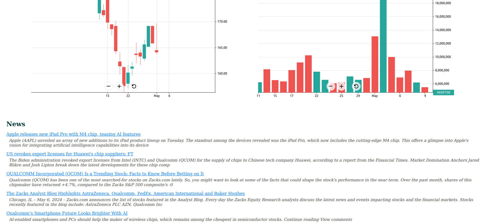
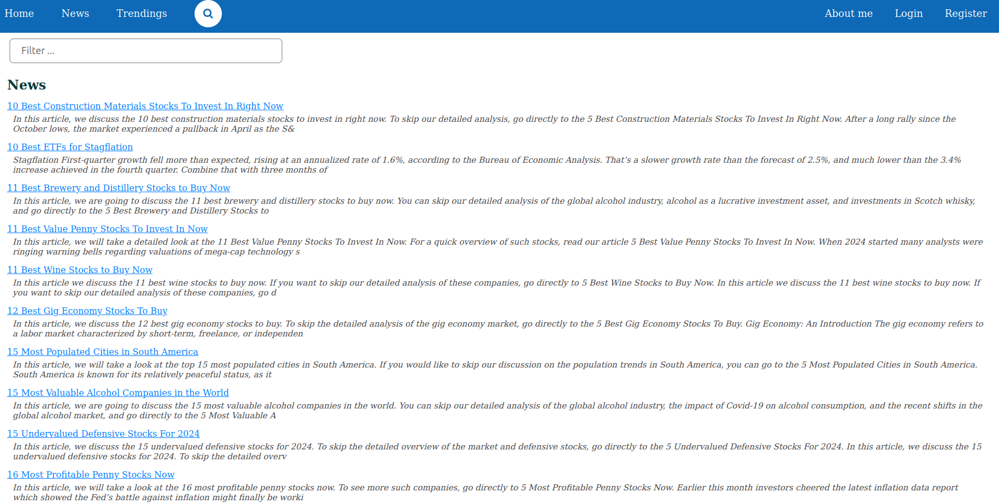
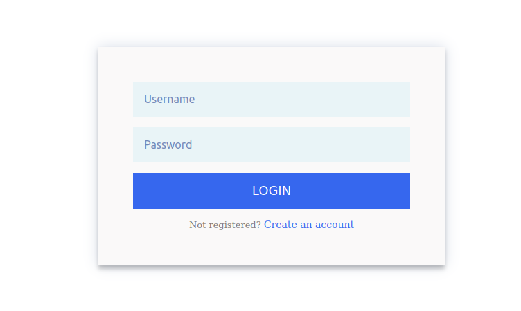
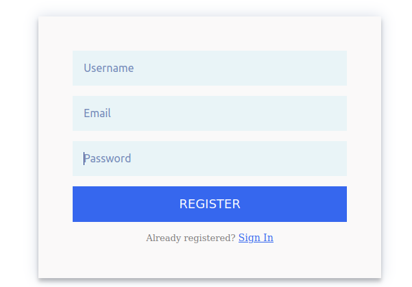

* The stock price has the following pages:
   - Home page contains the pagignation of info of more than 4000 tickers (ticker name, company, country, industry, prices). You can search the ticker by ticker name, industry, company, industry or its sector.
   - Trending page shows the ticker trending scrapped from yahoo finance website.
   - Ticker page includes the related news, volume and price changing charts.
   - News page contains all news of all tickers that are displayed with the pagignation. You can search the news with the filter box at the top of the page.
   - Login and Register pages.
 
* Some screen shots of each pages:
  
## Home page:

*Search by country name (USA)*

*Search by ticker name (QCO)*

## Trending page:

## Ticker page:

*chart*

*related news*

## News page:

## Login/Register page:

 &nbsp;&nbsp;&nbsp;&nbsp; 

# TODO:
- Deploy the application in Docker then AWS
